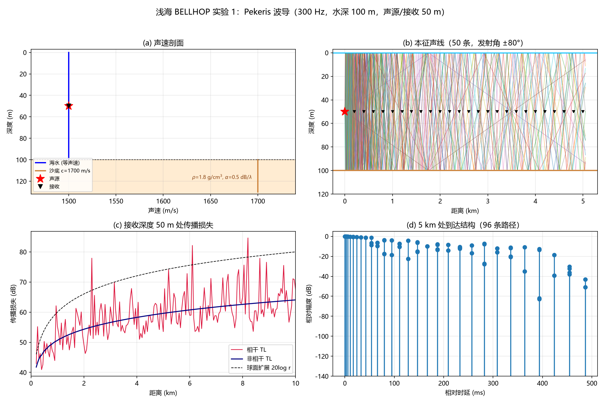
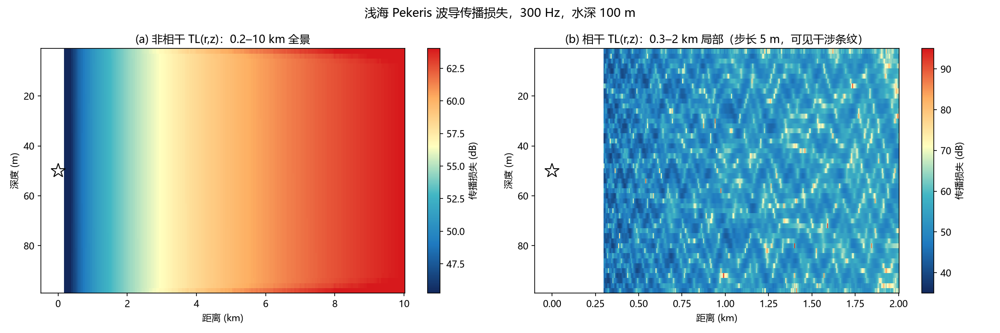
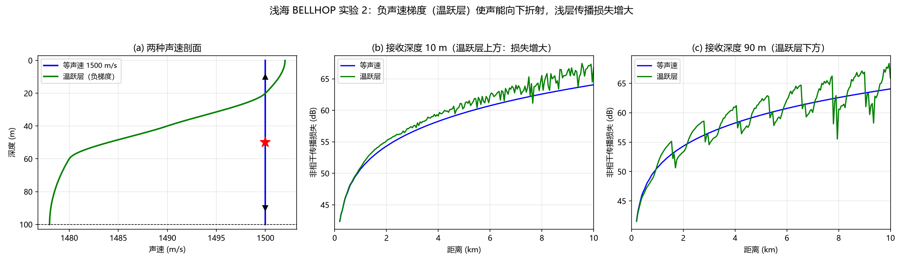

# 浅海声传播 BELLHOP 仿真

Shallow-water acoustic propagation simulation with BELLHOP: eigenrays, arrival
structure, transmission loss and thermocline comparison.

用 BELLHOP 计算浅海波导中的声线、到达结构与传播损失，并分析温跃层（负声速
梯度）对声传播的影响。全部结果由本项目脚本实际计算得到，含完整实验报告。



## 计算场景

水深 100 m 的浅海波导，海水等声速 1500 m/s，沙质海底（声速 1700 m/s、
密度 1.8 g/cm³、吸收 0.5 dB/λ），工作频率 300 Hz，声源与接收均为 50 m 深，
作用距离 0.2–10 km，发射角 ±80°。对照场景把海水换成温跃层剖面
（表层 1502 m/s 线性下降到 100 m 处 1478 m/s），其余条件不变。

## 主要结果

| 项目 | 结果 |
| --- | --- |
| 5 km 处到达路径 | 96 条，时延展宽 487 ms（最早 3.3333 s，与 5000/1500 的解析值一致） |
| 非相干传播损失 | 1 km 处 50.6 dB，10 km 处 64.1 dB，增长速率约 13.4 dB/十倍距离 |
| 相干传播损失 | 围绕平均趋势波动，标准差 5.8 dB，极值区间 40.9–84.6 dB |
| 温跃层影响 | 浅层 10 m 处损失最多增加 2.7 dB，深层 90 m 在 2.4 dB 以内 |

实测传播损失的增长速率落在理想波导的柱面扩展（10 log r）与自由空间球面扩展
（20 log r）之间，近场与球面扩展吻合、远场转为柱面型扩展，符合浅海波导的
基本规律；相干曲线的起伏来自多阶简正波干涉。



## 项目内容

- **环境搭建与计算流程**：`aubellhop` + `arlpy`，完成声线（R）、到达结构（A）、
  相干与非相干传播损失（C/I）四类计算任务
- **工程问题排查**：定位并修复了一个隐蔽的运行库不兼容问题（详见下文），
  该问题导致"声线与到达计算正常、传播损失必崩"的部分功能失效现象
- **温跃层对比实验**：改变声速剖面，量化声线向下折射带来的额外传播损失
- **可复现交付物**：分步 Jupyter notebook + 12 页 Word 实验报告（含原理、
  操作步骤、检查点与结果分析）



## 快速开始

```bash
conda create -n underwater python=3.12 -y
conda activate underwater
pip install -r requirements.txt

python scripts/shallow_water_bellhop.py     # 全部计算与绘图，约 5 秒
```

结果写入 `output/`：`figures/` 为图片，`data/` 为 CSV 与 summary.json。
Windows 下也可以直接运行 `run.bat`。

分步复现（推荐第一次使用时对照学习）：

```bash
python scripts/build_notebook.py            # 生成 notebooks/01_shallow_water_bellhop.ipynb
```

notebook 把实验拆成环境自检、声线、到达结构、传播损失、传播损失场、温跃层
对比六步，每一步都给出检查点和预期数值。

## 目录结构

```
├── scripts/
│   ├── shallow_water_bellhop.py   命令行完整实验（声线 + 到达 + 传播损失 + 温跃层）
│   ├── _bellhop_runtime.py        运行环境自检与 PATH 自举
│   ├── build_notebook.py          生成分步复现 notebook
│   ├── report_figures.py          生成报告插图与公式图片
│   ├── build_report_docx.py       生成 Word 实验报告
│   ├── render_report_qa.py        Word 导出 PDF 再转逐页图片，用于排版检查
│   └── word_export_pdf.py         Word 自动化导出 PDF
├── notebooks/                     分步复现 notebook（由脚本生成）
├── output/
│   ├── figures/                   声线、传播损失、传播损失场、温跃层对比
│   ├── data/                      传播损失曲线、到达结构、损失场矩阵、汇总
│   └── report/                    浅海声传播BELLHOP仿真实验报告.docx
└── requirements.txt
```

## Windows 运行库问题

如果出现下面两种情况之一，是运行库版本不匹配导致的，值得记录：

**现象一**：报 `Bellhop did not generate expected output file`。
`arlpy` 只通过系统 PATH 查找 `bellhop.exe`，不会去 Python 包目录里找。
项目里的 `scripts/_bellhop_runtime.py` 会自动定位并把目录加入 PATH；
如果自己写脚本调用，需要注意这一点。

**现象二**：声线（R）与到达结构（A）计算正常，但相干/非相干传播损失
（C/I）直接崩溃，退出码 `0xC0000374` 或 `0xC0000005`。

原因是 aubellhop wheel 自带的 `bellhop.exe` 由 MSYS2 GCC 16.1.0 编译，
运行时需要同一来源的 Fortran 运行库。如果系统里优先加载了 conda-forge 的
`libgfortran`（16.2.0），两者 ABI 不匹配，`R`/`A` 路径恰好不出错，
而需要写 `.shd` 文件的传播损失路径会内存损坏。解决办法是把下列 7 个 MSYS2
运行库复制到 `bellhop.exe` 同目录（Windows 会优先从可执行文件所在目录加载
动态库）：

```
libgfortran-5.dll   libgcc_s_seh-1.dll   libwinpthread-1.dll
libquadmath-0.dll   libgomp-1.dll        libatomic-1.dll
libstdc++-6.dll
```

这些文件来自 MSYS2 的 `mingw-w64-x86_64-gcc-libgfortran`、
`mingw-w64-x86_64-gcc-libs` 与 `mingw-w64-x86_64-libwinpthread-git` 包，
版本号需与编译 exe 的 GCC 一致。由于许可与体积原因，仓库不包含这些二进制。

## 实验报告

[output/report/浅海声传播BELLHOP仿真实验报告.docx](output/report/浅海声传播BELLHOP仿真实验报告.docx)

报告面向第一次接触水声计算的读者，包含：水声基础知识（声速与声速剖面、声线
折射、传播损失与扩展规律、多途与相干/非相干、简正波干涉、海面与海底边界、
BELLHOP 运行类型）、可复现的实验步骤与检查点、结果分析、可信度与局限讨论、
常见问题排查表。需要修改内容后重新生成时：

```bash
python scripts/report_figures.py            # 生成报告插图与公式图片
python scripts/build_report_docx.py         # 生成 DOCX（需要 python-docx）
python scripts/render_report_qa.py output/report/浅海声传播BELLHOP仿真实验报告.docx
```

## 参考资料

1. M. B. Porter. *The BELLHOP Manual and User's Guide: Preliminary Draft*, 2011.
2. M. B. Porter. *Acoustics Toolbox*. http://oalib.hlsresearch.com/AcousticsToolbox/
3. F. B. Jensen, W. A. Kuperman, M. B. Porter, H. Schmidt. *Computational Ocean
   Acoustics*, 2nd ed., Springer, 2011.
4. R. J. Urick. *Principles of Underwater Sound*, 3rd ed., McGraw-Hill, 1983.

## 许可

本项目代码采用 MIT 许可。BELLHOP 可执行文件及 aubellhop、arlpy 软件包版权归
各自作者所有，遵循其开源许可。
